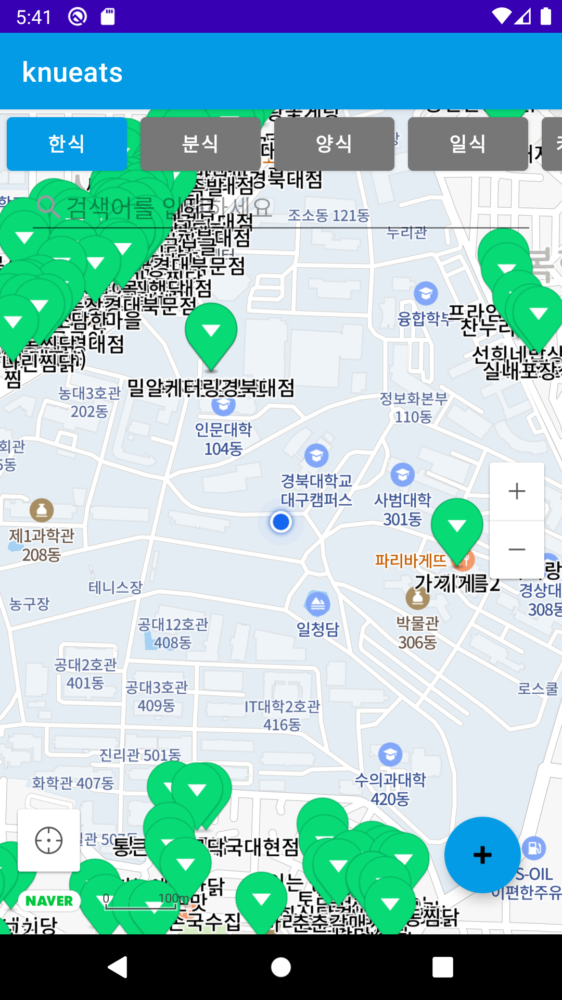
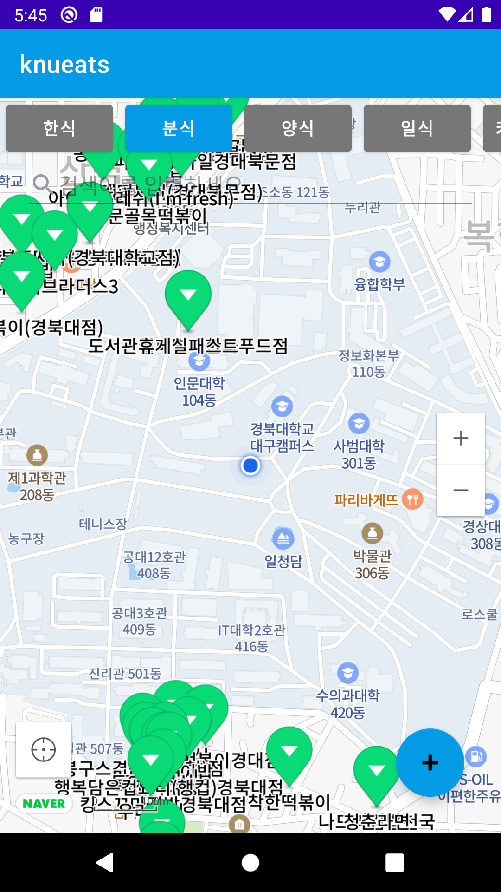
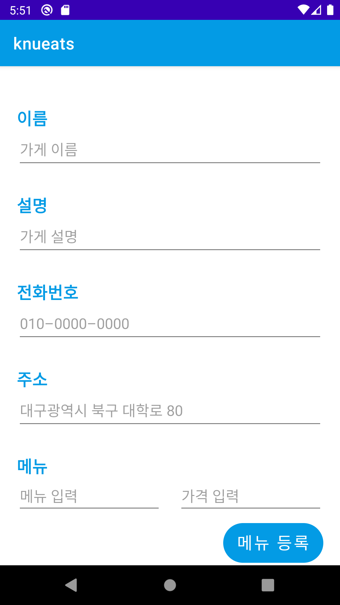
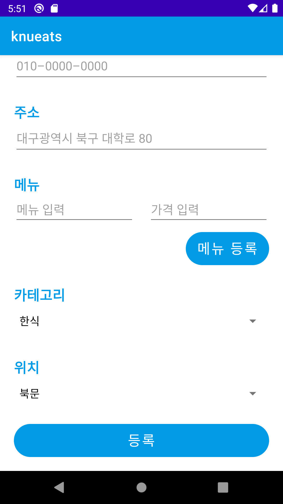
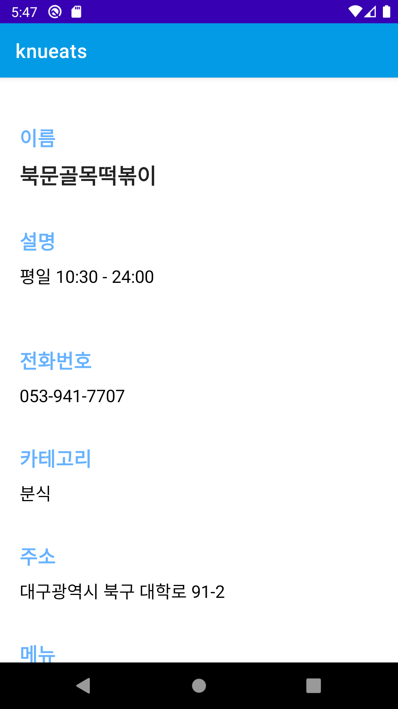
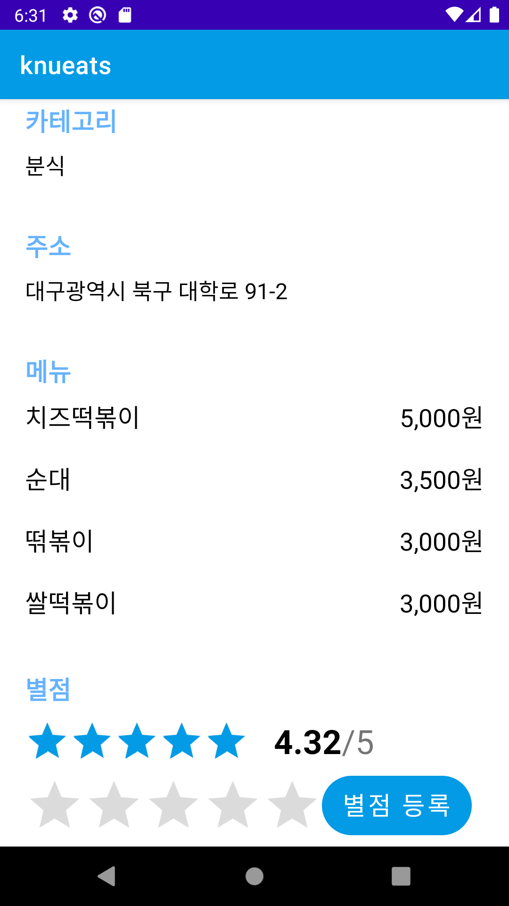
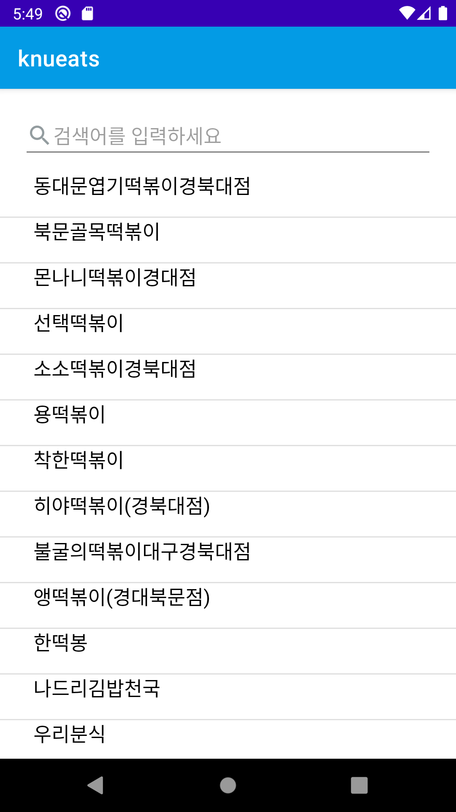

# KNUeats Project

## 📝 project 소개

경북대학교 주변에 있는 맛집을 알려주고 등록할 수 있는 어플리케이션 프로젝트 입니다.
## Contributors
### FrontEnd
|  |  |  |
| :--------------------------------------------------------------------------------------: | :----------------------------------------------------------------------------------------------: | :--------------------------------------------------------------------------------------: 
|                          [김동환](https://github.com/gidskql6671)                           |                            [조희원](https://github.com/huihuiwon)                             |                        [최명빈](https://github.com/choimyungbin)                           |
### BackEnd
|  |  |
| :--------------------------------------------------------------------------------------: | :----------------------------------------------------------------------------------------------: |
|                          [오영선](https://github.com/oyoungsun)                           |                            [장윤성](https://github.com/JangYunSeong)                             |
## Stack
### FrontEnd
 

### BackEnd - Server
 

### BackEnd - Data
 

### Server Deploy
 

## Project 설명
[네이버 Maps Open API](https://guide.ncloud-docs.com/docs/naveropenapiv3-maps-overview)를 사용한 프로젝트입니다.  

### 기능 설명
- 학교 주변의 가게들을 지도를 통해 조회할 수 있다.
- 누락된 가게가 있다면 추가할 수 있다.
- 가게의 상세 정보를 확인할 수 있다.
- 가게의 별점을 조회하고, 등록할 수 있다.
- 키워드로 가게를 검색할 수 있다.

## 데모 사진
### 메인 화면
**한식 카테고리의 가게들**  

**분식 카테고리의 가게들**  

### 가게 등록 화면

### 가게 상세 조회 화면

### 가게 검색 화면
